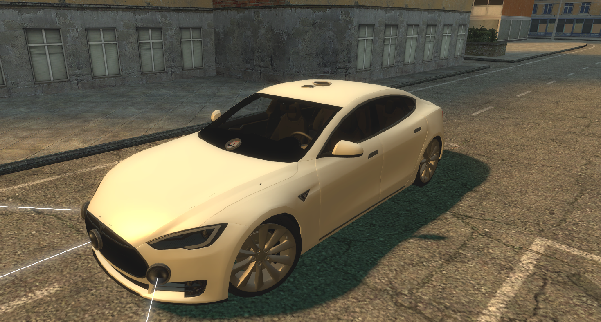
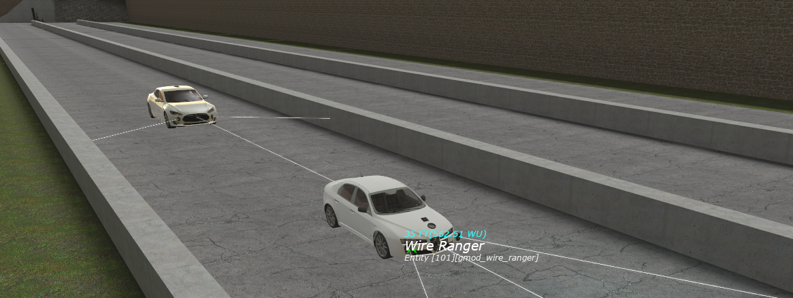

# Garry's Mod Wiremod Self-Driving
This code allows Garry's Mod vehicles primarily from simfphys to drive themselves using Expressions 2 from Wiremod. Rangers are used as inputs and also a speedometer. Should work perfectly on roads with high walls. Also has adaptive cruise control (ACC) if there's a vehicle or any other object in front and partially automatic emergency braking (AEB). Should have smooth acceleration and braking. There's an attempt to use PID controller for steering (not sure if it's actually correct). This is my project I've been working on when bored in Garry's Mod. It actually didn't take long time to do it once I understood it all after my previous attempts.

### Setup
Doesn't work well on roads without high walls usually

### Example (gm_buildnrace)

## Inputs
* **Make sure output distance, output velocity, output entity+entid is enabled in the ranger spawn menu**
* **Also set the ranger distance to 8192 by typing it in there**

### Don't forget to configure the braking time from 1000 gm/s to 0
`BrakingTime = 1 * (Speed / 1000)`
By default it is configured that it takes 1 second from 1000 gm/s to 0. With the vehicle and braking time I use for testing in case of emergency braking it leaves 5 gmod units in front from the obstacle, which is amazing.

### Rangers
* Front - facing forward
* Left - face about 60-70° left
* Right - face about 60-70° right

### Expression 2 inputs
* Front - front ranger distance
* Left - left ranger distance
* Right - right ranger distance
* Driver - driver of the vehicle (disabled when there's a driver as in simfphys it can't control steering at least for me, you can as a passanger though)
* Speed - speedometer garry's mod speed (Out output)
* VX - front ranger VX (velocity)
* VY - front ranger VY (velocity)
* VZ - front ranger VZ (velocity)
* FrontID - front ranger EntityID

## Outputs
* Engine
* Throttle
* Steer
* Brake
* Handbrake
* Beep - sound warning
* RGB - rgb of the light 